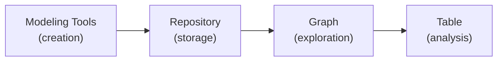

# Vision: Architeezy Graph

## Executive Summary

Architeezy Graph is a **visual exploration and analysis tool** for enterprise architecture models.
It transforms complex metamodel instances into interactive graphs and tables, enabling architects,
engineers, and stakeholders to **understand, navigate, and communicate** structural relationships at
any scale — from small diagrams to enterprise-wide repositories with thousands of elements.

Graph addresses the fundamental challenge of **model comprehension**: architects need to see both
the forest and the trees, switching seamlessly between high-level topology and detailed element
properties, without losing context.

## The Problem We Solve

### Pain Points in Enterprise Architecture

1. **Information overload**
   - Modern enterprise models contain hundreds or thousands of elements (components, services, data
     stores, business processes)
   - Traditional documentation (Word, Excel, Visio) becomes unmaintainable at scale
   - Static diagrams cannot show filtered views or drill into details

2. **Tool fragmentation**
   - Architects use multiple disconnected tools: modeling tools, document editors, diagramming tools
   - No unified view of the model with live data
   - Inability to quickly validate consistency across views

3. **Collaboration barriers**
   - Non-technical stakeholders cannot explore models without specialized training
   - Architecture decisions are made based on outdated or incomplete information
   - Difficulty tracing impact of changes across the landscape

4. **Context loss during exploration**
   - When focusing on a specific component, architects lose sight of the broader ecosystem
   - Manual filtering and navigation is time-consuming and error-prone
   - No persistent, shareable views of "what I'm looking at"

## Our Solution: Graph

### Core Capabilities

#### Unified Visual Exploration

- **Graph view**: Interactive force-directed/hierarchical layout with smooth zoom, pan, and
  selection
- **Table view**: Tabular representation with sorting, filtering, and cross-navigation to graph
- **Seamless switching**: Jump between views without losing selection or filter state

#### Intelligent Filtering

- **Type-based filtering**: Show/hide element and relationship types independently
- **Search-as-you-type**: Instant filtering across element names, types, and properties
- **Persistent views**: Save filter configurations and share via URL

#### Drill-down Analysis

- **Neighborhood scope**: From any node, explore N levels of relationships
- **Dynamic context**: The drill root remains visible even when its type is filtered out
- **Depth control**: Adjust exploration depth on-the-fly (1-5 levels)
- **Cross-cutting edges**: Only show edges within the current drill scope

#### Real-time Sync & Sharing

- **URL state**: Every view state encoded in URL (filters, drill, view mode)
- **Shareable links**: Send colleagues a direct link to your current analysis
- **Theme persistence**: User preferences saved across sessions

#### Performance at Scale

- Handles models with thousands of elements without performance degradation
- Filtering and navigation remain responsive regardless of model size
- Large datasets in table view remain scrollable and searchable without blocking

## Target Users

### Primary: Enterprise Architects

- **Use case**: Reviewing application portfolios, analyzing dependencies, planning migrations
- **Needs**: Quick overview of landscape, ability to drill into specific components, trace
  relationships
- **Example**: "Show me all databases connected to legacy monoliths, and the services that depend on
  them"

### Secondary: Solution Architects & Engineers

- **Use case**: Understanding system context before making design changes, impact analysis
- **Needs**: Clear view of integration points, data flows, and ownership boundaries
- **Example**: "What components will be affected if we decommission this API?"

### Tertiary: Technical Managers & PMs

- **Use case**: High-level dashboards, progress tracking, stakeholder communication
- **Needs**: Simplified views focusing on business-critical elements, easy sharing
- **Example**: "Send me a link showing all payment-related services and their deployment status"

## Key Differentiators

| Feature                   | Graph                                    | Traditional Modeling Tools  | Documentation Platforms    |
| ------------------------- | ---------------------------------------- | --------------------------- | -------------------------- |
| **Live model view**       | ✅ Real-time sync with model repository  | ❌ Static exports           | ❌ Static pages            |
| **Interactive filtering** | ✅ Instant, multi-dimensional            | ❌ Manual diagram editing   | ❌ Search only             |
| **Drill-down analysis**   | ✅ Neighborhood scope with depth control | ❌ Manual navigation        | ❌ Impossible              |
| **Shareable state**       | ✅ Full state in URL                     | ❌ Proprietary formats      | ❌ Read-only               |
| **Graph + Table**         | ✅ Dual representation, cross-linked     | ❌ Single view only         | ❌ Tables only             |
| **Performance**           | ✅ Handles 10k+ elements smoothly        | ❌ Locks up on large models | ❌ Not designed for graphs |

## User Journeys

### Journey 1: Portfolio Analysis

```text
1. Open Graph, select "Production" model
2. Switch to Graph view, choose hierarchical layout
3. Filter: show only Services and Databases
4. Type "payment" in filter search → narrows to payment-related components
5. Double-click on "PaymentService" → drill down 2 levels
6. Export view as CSV for reporting
7. Copy URL → share with team
```

**Value**: 5 minutes to produce a focused, shareable analysis that previously took hours.

### Journey 2: Impact Assessment

```text
1. Receive change request: "Replace Oracle DB with PostgreSQL"
2. Search for "Oracle" in table view → find 12 instances
3. Click each row → graph centers on the database
4. Drill down 3 levels → see all dependent services
5. Filter: hide non-production nodes
6. Count affected services: 47 across 5 teams
7. Save configuration as "OracleMigration" for follow-up
```

**Value**: Complete impact traceability without manual diagram traversal.

### Journey 3: Onboarding

```text
1. New engineer joins payments team
2. Mentor sends Graph link pre-filtered to payments domain
3. Engineer explores graph: sees team's services, dependencies, owned data
4. Clicks on unfamiliar service → reads documentation in detail panel
5. Searches for "auth" → discovers shared auth service
6. Exports table of all owned components
```

**Value**: Self-guided exploration reduces mentorship burden by 60%.

## Success Metrics

### Adoption & Engagement

- **Weekly Active Users (WAU)**: Target 70% of architect population within 6 months
- **Session duration**: Average >15 minutes (indicates meaningful exploration)
- **Share rate**: >25% of sessions result in URL copy (indicates value creation)

### Performance

- **Model load time**: Fast enough that users can start exploring without perceivable wait
- **Filter latency**: Instant — users never wait for filter changes to take effect
- **Layout time**: Responsive for all supported model sizes

### Quality

- **Error rate**: <1% of sessions encounter fatal errors
- **Feature completeness**: 100% of core journeys (load, filter, drill, share) work without issues
- **Accessibility score**: WCAG 2.1 AA compliant

## Strategic Alignment

### Architeezy Ecosystem

Graph is the **consumption layer** for Architeezy's modeling platform:



- **Interoperability**: Seamlessly loads any EMF/Ecore-based model from the repository
- **Consistent UX**: Shared design system with other Architeezy apps (Table, etc.)
- **Cross-app navigation**: From Graph you can "Open in Table" for matrix analysis

## Future Roadmap

### Phase 1: Foundation (Current)

- ✅ Graph visualization with multiple layouts
- ✅ Table view with sorting and filtering
- ✅ Drill-down with depth control
- ✅ URL state persistence
- ✅ Basic filtering UI

### Phase 2: Enhanced Discovery

- **Saved views**: Named filter configurations persisted across sessions
- **Comparison mode**: Side-by-side view of two model versions with diff highlighting
- **Element highlighting**: Search results highlighted directly in the graph
- **Bookmarks**: Pin frequent nodes for quick access
- **Export**: Graph export as image file

### Phase 3: Collaboration

- **Annotations**: Comments and notes attached to specific nodes
- **Team sharing**: Shared view configurations stored server-side
- **Change notifications**: Alerts when the loaded model is updated
- **Presentation mode**: Full-screen walkthrough for stakeholder sessions

### Phase 4: Advanced Analysis

- **Cycle detection**: Visual warnings for circular dependencies
- **Path finding**: Shortest-path exploration between any two nodes
- **Metrics dashboard**: Live model statistics (counts, type distribution, connectivity)
- **Custom styling**: User-defined visual schemes per element type
- **Embed support**: External tools can embed Graph views

## Competitive Landscape

### Direct Competitors

- **Sparx Enterprise Architect**: Heavy desktop client, poor web UX, expensive
- **Visual Paradigm**: Similar limitations, requires installation
- **draw.io**: Manual diagramming, not model-driven

### Indirect Competitors

- **Neo4j Bloom**: Graph-focused but requires Cypher knowledge, not architecture-oriented
- **Gephi**: Academic/research tool, not enterprise-ready
- **Custom internal tools**: Brittle, unmaintainable, no standardization

**Graph advantage**: Purpose-built for architecture models, zero-training UX, web-native, open
integration.

## Business Model Context

Graph is a **completely free, open-source demonstration application** developed by Architeezy to
showcase the capabilities of our modeling platform and attract users to the ecosystem.

### Why Free?

- **Democratize architecture tools**: Remove financial barriers so any team can experience modern
  architecture visualization
- **Ecosystem showcase**: Demonstrate what's possible with Architeezy's repository and metamodel
  standards
- **Community building**: Encourage adoption, contributions, and word-of-mouth growth
- **Feedback loop**: Real users provide invaluable insights that shape the future of all Architeezy
  products
- **Thought leadership**: Establish Architeezy as the standard for enterprise architecture
  visualization

Graph has **no artificial limits** on model size, feature set, or usage duration. It's free forever
for everyone.

While Graph itself is free, it serves as the **entry point** to Architeezy's commercial ecosystem:

- Users who love Graph may explore **Table** for matrix analysis
- Teams needing authoring tools may consider **Architeezy Studio**
- Enterprises with advanced requirements can adopt **Architeezy Platform** (on-premise, SSO,
  support)

Graph proves the value, making the upgrade decision obvious.

## Call to Action

For stakeholders: **Support Graph** as the gateway to Architeezy's ecosystem — it democratizes
architecture access, accelerates decision-making, and establishes our platform as the de facto
standard for enterprise architecture visualization.

For users: **Try Graph** when you need to answer questions like:

- "What's actually in our model?"
- "How are these systems connected?"
- "What will break if we change this?"
- "Who owns this component?"

Graph turns static models into **living, explorable knowledge graphs** — completely free, forever.
